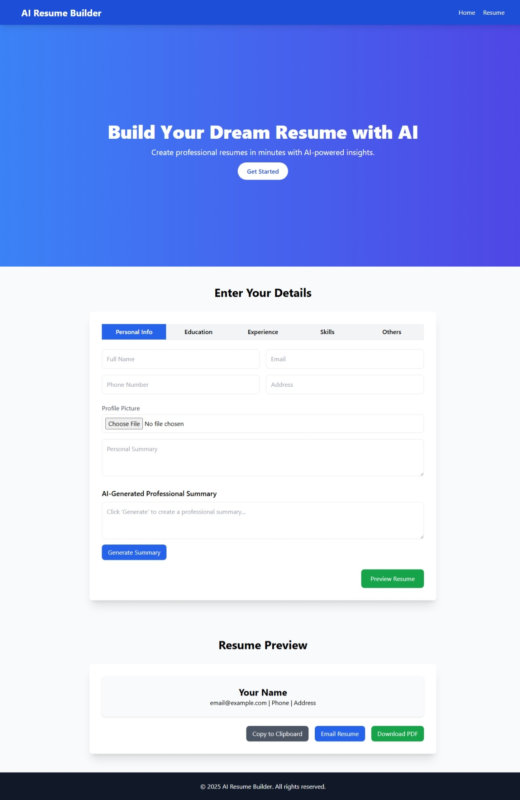

## AI Resume Builder 2025

### live Demo


An advanced, AI-powered resume builder website built with HTML, CSS, JavaScript, and Google Gemini API. Users can input comprehensive details to generate a professional, downloadable resume with real-time previews.
Features




- Comprehensive Inputs: Full name, contact info, profile picture, personal summary, education, work experience, certifications, - languages, soft/hard skills, interests.
- AI Integration: Generates professional summaries using Google Gemini API (mocked in this version).
- Real-Time Preview: Updates resume preview as users type.
- Responsive Design: Mobile-first layout with Tailwind CSS.
- Animations: Smooth fade-in and hover effects.
- Export Options: Download as PDF, copy to clipboard, or email resume.
- Modern UI: Fixed header, hero section, tabbed form, and stylish cards.


### Tech Stack

- HTML5: Page structure.
- Tailwind CSS/CSS3: Responsive styling and animations.
- JavaScript: Form handling, real-time updates, and API integration.
- Google Gemini API: AI-powered summary generation (mocked).
- jsPDF: PDF export functionality.

### Setup Instructions

- Clone the repository:
  ```bash
   git clone https://github.com/muzamal478/ai-resume-builder-2025.git

Open index.html with a browser or use VS Code Live Server.

### To use the Gemini API:

- Obtain an API key from Google Cloud.
- Update callGeminiAPI in js/script.js with a real API call.


### File Structure
ai-resume-builder-2025/

- index.html     # Main HTML file
- styles.css     # Custom styles 
- script.js      # Application logic
- README.md      # Documentation

